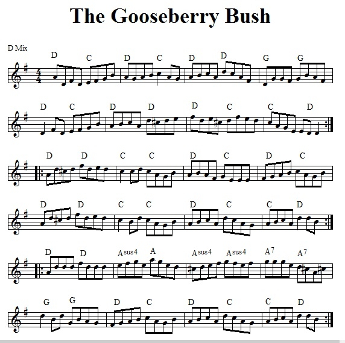
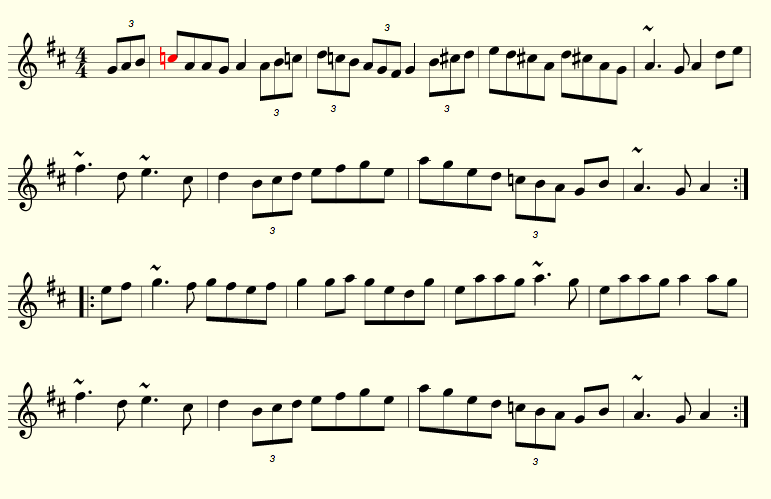

# Rough collection of accompaniment notes

If anyone's reading this, I still have tons to learn, but what better a time to
write down things that I notice, while my eyes/ears/hands are still fresh to
the task.

Many tunes follow patterns that you can sort of guess at: major tunes stick to
I, IV, V; aeolian and mixolydian tunes often end up with repeating two chords,
and throwing in extra chords for spice. Substitutions are often possible, but
also, what becomes tricky is the tunes that do not follow this, and knowing
why.

## Funky VIIs

Some tunes have a habit of varying a sharp or natural VII. This means C♮/C♯ for
tunes in the key of D-ish, and F♮/F♯ for tunes in G-ish. Good examples of this
are: 

 * Gooseberry Bush
 * Poll Ha'penny 

Note that some settings of Poll Ha'penny may also have a G♮/G♯ alternation,
but, this is not really the same thing.

Anyway, since both of the above tunes are mixolydian, you may rely on `I` and flat
`VII` a lot. Mixolydian tunes like these also allow for substitution of the
flat `VII` with a minor `V`. The complication with tunes that alternate between
sharp and natural VIIs in the melody is that a minor `V` may clash sometimes:
so, just open it up.

### Gooseberry Bush

[Source](http://home.comcast.net/~saustin98/lark/vcpsm.htm?gooseberrybush.jpg)

### Poll Ha'penny

[Source](http://thesession.org/tunes/841)

